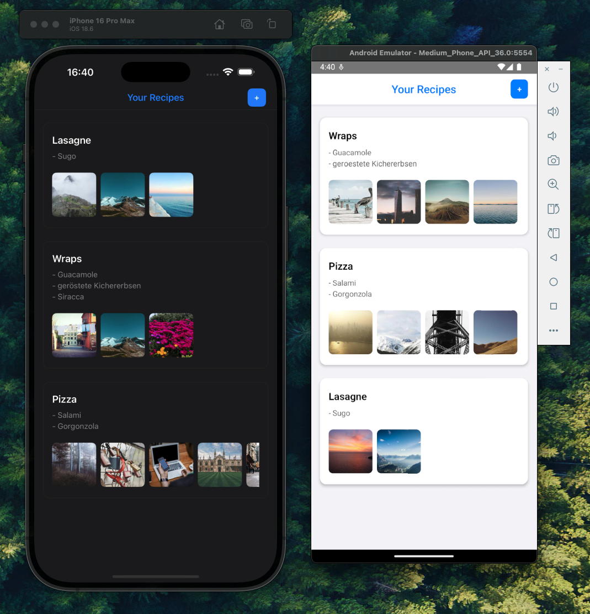

# Recipe Management App

A React Native 0.75.4 recipe management app built with TypeScript. This app allows users to create, view, and manage their favorite recipes with image support and an intuitive swipe-to-delete interface.



## Features

- **Recipe Management**: Create, edit, and delete recipes with titles, descriptions, and multiple images
- **Image Support**: Add images from camera, gallery, or generated placeholders with caching optimization
- **Gesture Controls**: Swipe-to-delete functionality with haptic feedback
- **Theme Support**: Automatic light and dark mode support that follows device system settings
- **Data Persistence**: Local storage with AsyncStorage and in-memory caching
- **Performance Optimized**: FastImage integration and React.memo optimizations throughout

## Architecture

- **Navigation**: React Navigation v6 with native stack navigator
- **State Management**: Local AsyncStorage with mutex-based concurrency control
- **Image Handling**: FastImage with custom caching layer and Picsum placeholder generation
- **UI Components**: Gesture-based interactions with Reanimated v3
- **Form Management**: Custom hook-based form validation with change detection

# Getting Started

>**Note**: Make sure you have completed the [React Native - Environment Setup](https://reactnative.dev/docs/environment-setup) instructions till "Creating a new application" step, before proceeding.


## Setup

Install node modules and pods

```bash
yarn && npx pod-install
```

## Step 1: Start the Metro Server

First, you will need to start **Metro**, the JavaScript _bundler_ that ships _with_ React Native.

To start Metro, run the following command from the _root_ of your React Native project:

```bash
yarn start
```

## Step 2: Start your Application

Let Metro Bundler run in its _own_ terminal. Open a _new_ terminal from the _root_ of your React Native project. Run the following command to start your _Android_ or _iOS_ app:

### For Android

```bash
# OR using Yarn
yarn android
```

### For iOS

```bash
# OR using Yarn
yarn ios
```

If everything is set up _correctly_, you should see your new app running in your _Android Emulator_ or _iOS Simulator_ shortly provided you have set up your emulator/simulator correctly.

This is one way to run your app — you can also run it directly from within Android Studio and Xcode respectively.

## Step 3: Modifying your App

Now that you have successfully run the app, let's modify it.

1. Open `App.tsx` in your text editor of choice and edit some lines.
2. For **Android**: Press the <kbd>R</kbd> key twice or select **"Reload"** from the **Developer Menu** (<kbd>Ctrl</kbd> + <kbd>M</kbd> (on Window and Linux) or <kbd>Cmd ⌘</kbd> + <kbd>M</kbd> (on macOS)) to see your changes!

   For **iOS**: Hit <kbd>Cmd ⌘</kbd> + <kbd>R</kbd> in your iOS Simulator to reload the app and see your changes!
